# 🏋️ Spark Powerhouse Gym – C# WinForms Gym Management Simulation

**Spark Powerhouse Gym** is a **C# WinForms–based desktop application** developed as part of academic coursework. The project simulates a gym management and membership system with a modern, web-style user interface.

The application focuses on **application flow design, role-based access, UI/UX consistency, and event-driven programming**, rather than real-world transactions or live integrations.

The system includes **separate User and Admin modes** and demonstrates how a real-world fitness management platform might function at a conceptual level.

---

## ✨ Features

### 👤 User Mode
- Web-style graphical user interface built using **C# WinForms**
- Home dashboard with menu-based navigation
- Browse gym information:
  - About Us
  - Contact Us
- View gym class schedules in a weekly timetable format
- Explore membership plans (3 / 6 / 12 months)
- Browse gym equipment via a dedicated shop
- Simulated checkout and payment flow
- Card payment *(simulation only)*
- Mobile payment *(bKash-style UI simulation)*
- OTP-based confirmation *(simulated)*

> **Note:** All purchases, payments, and OTP verifications are fully simulated.

---

### 🧑‍💼 Admin Mode
- Separate admin interface with restricted access
- Admin login authentication
- View registered users
- Monitor membership information
- Manage user-related records

---

### 🔐 General
- Role-based access control (Admin vs User)
- Event-driven desktop application design
- Modular WinForms structure
- Fitness-themed UI design
- Clear separation of workflows

---

## 📸 Application Screenshots

A visual walkthrough of the application highlighting key interfaces and role-based interactions.

---

### 🔐 Authentication & Mode Selection
Core entry points that define role-based access.

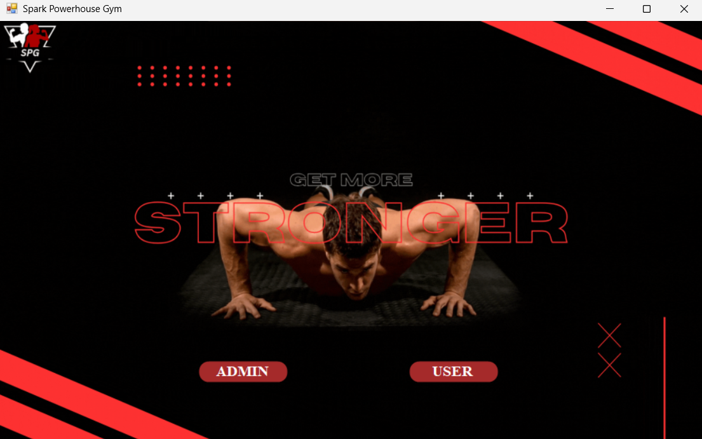
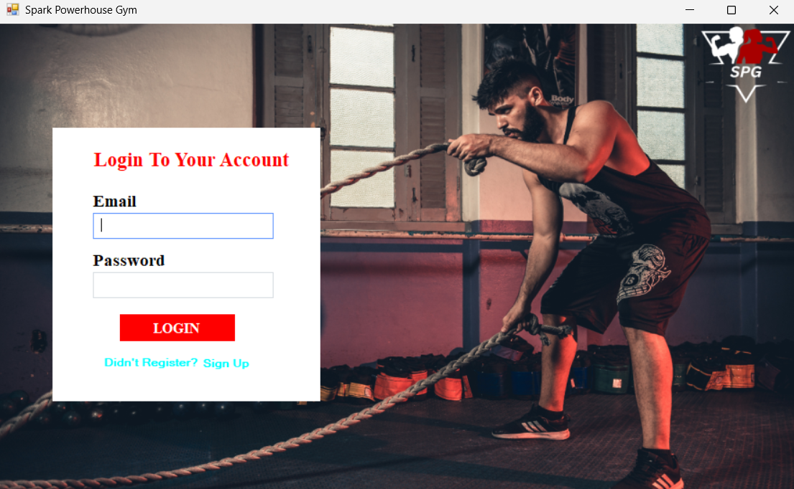
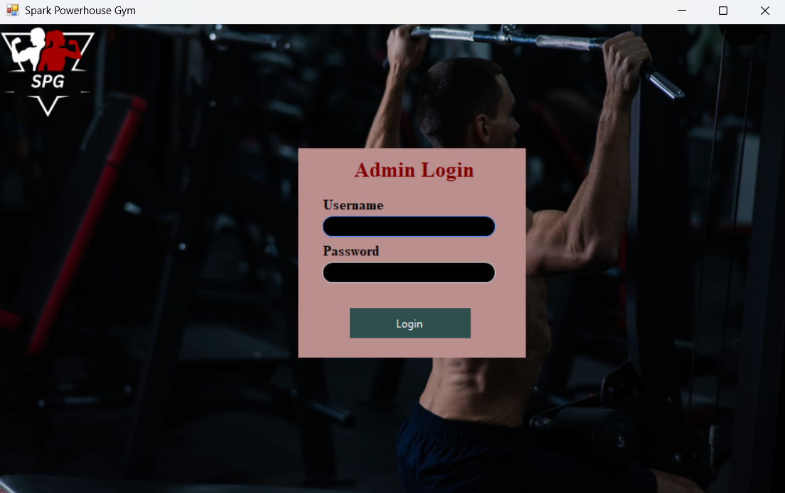

---

### 👤 User Experience
Primary user-facing features demonstrating navigation, services, and simulated interactions.

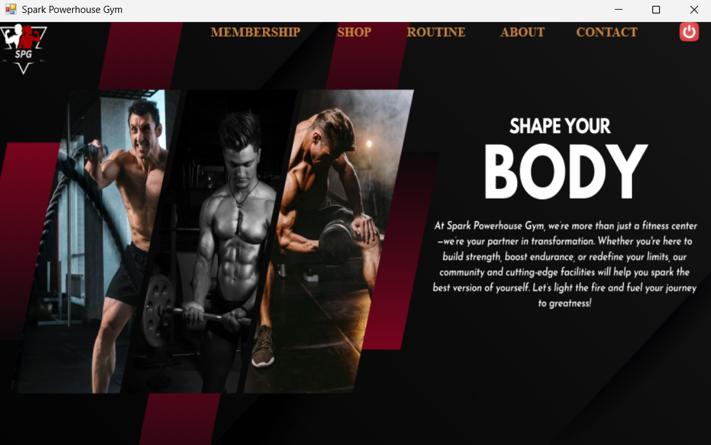
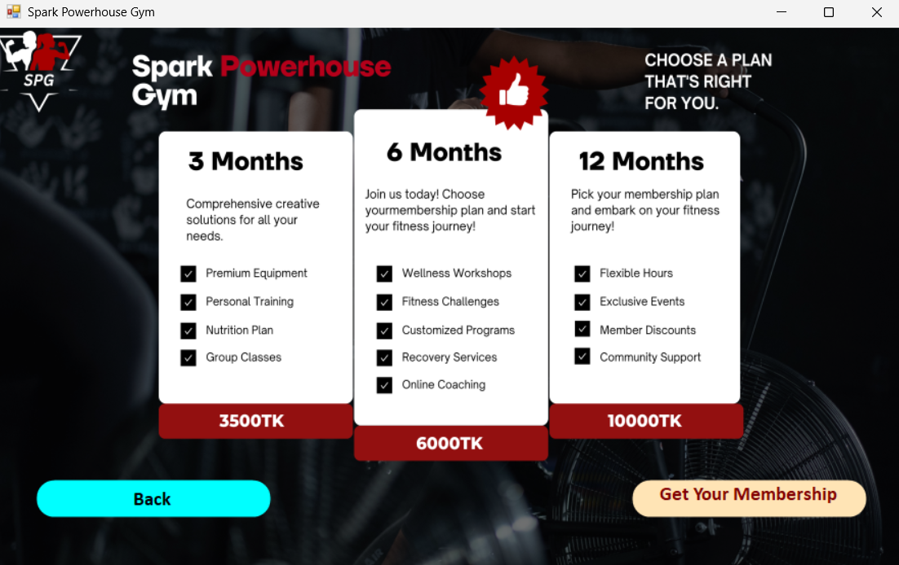
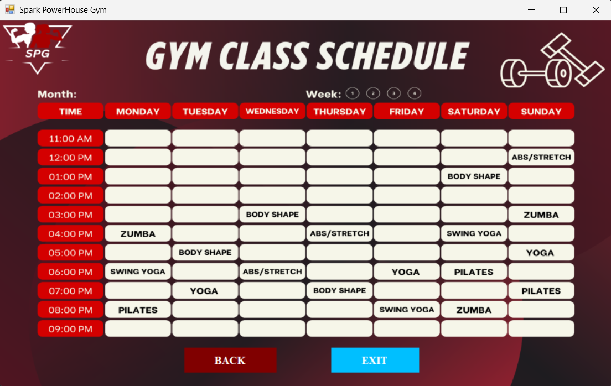
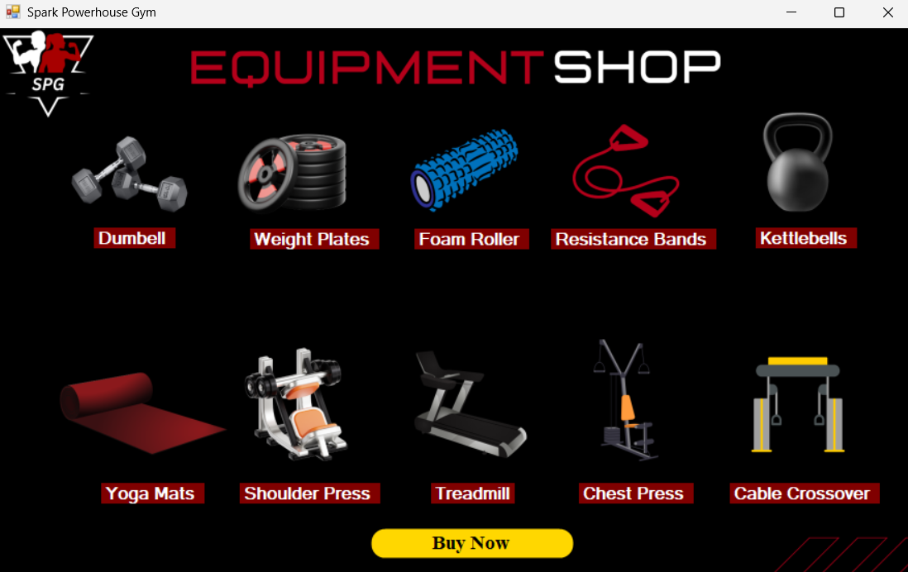

---

### 💳 Payment Simulation (Mock)
Demonstrates the simulated checkout and OTP-based confirmation flow  
(UI-only, no real transactions)

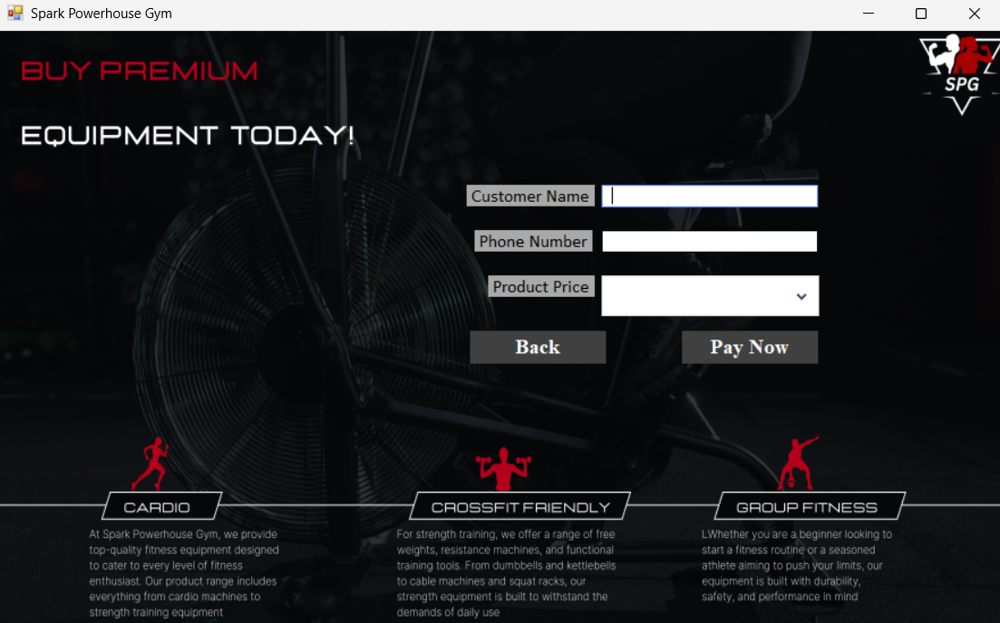
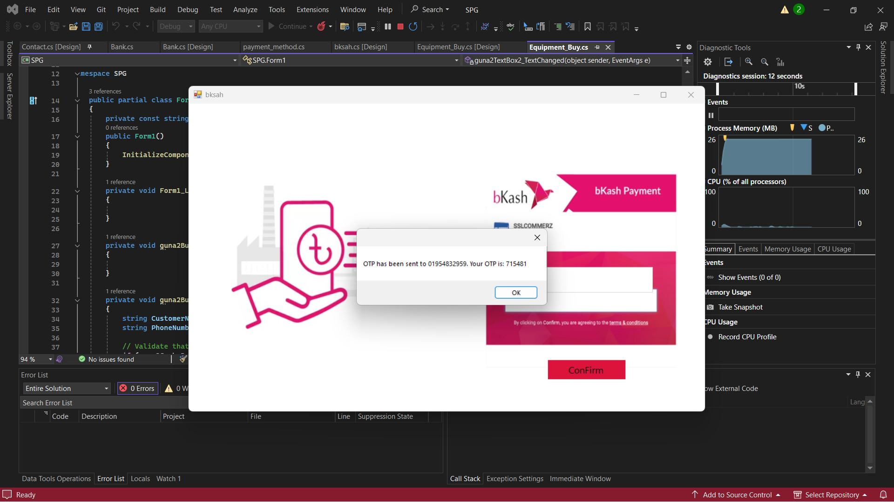

---

### 🛠 Admin Dashboard
Administrative controls for managing users and memberships.

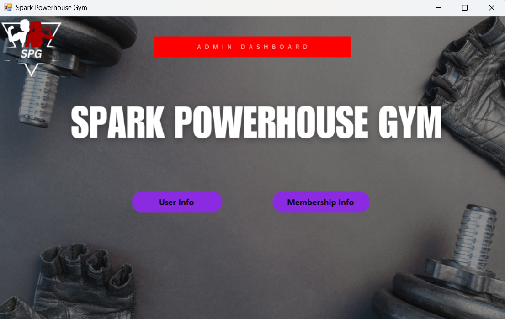
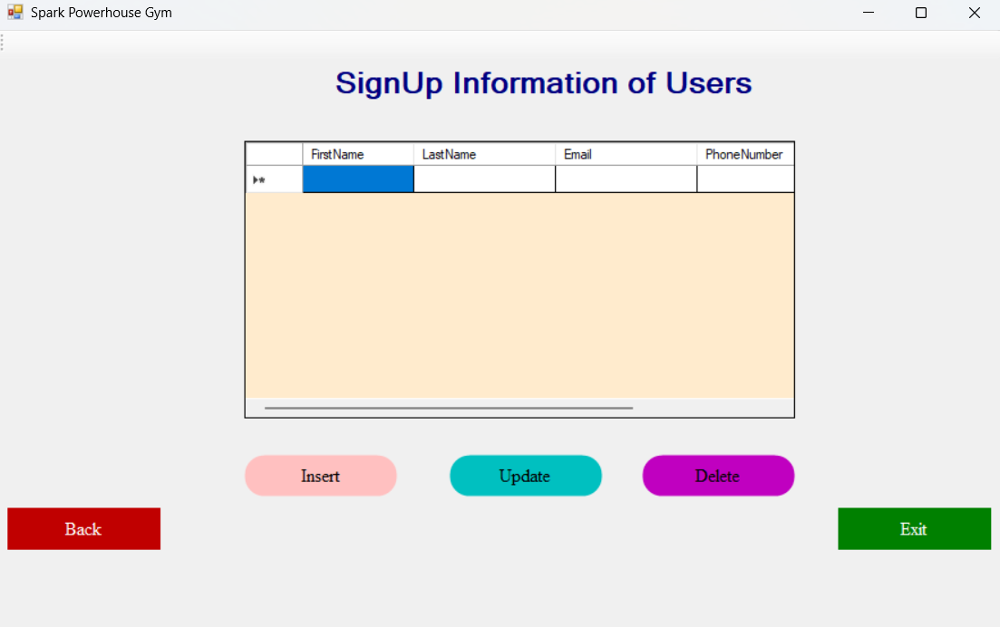
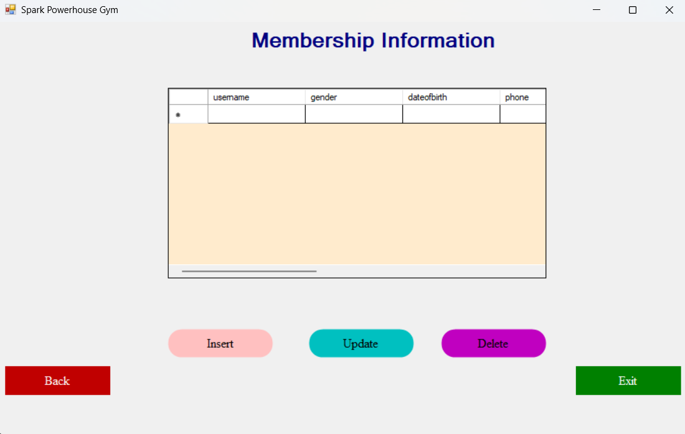

---

## 🛠 Technologies Used
- **C#**
- **.NET Framework**
- **Windows Forms (WinForms)**
- **SQL Server** *(local / simulated)*
- **Object-Oriented Programming (OOP)**
- **Event-Driven Programming**

---

## ▶ How to Run
1. Open the project in **Visual Studio**
2. Load `SPG.sln`
3. Build the solution
4. Run the project
5. The application window will launch

---

## ℹ Notes
- Simulation-based academic project
- No real payments, OTPs, or external services
- All workflows are mock implementations

---

## 👤 Author
**Sajidur Rahman Sajid**  
BSc in Computer Science & Engineering (CSE)  
Final-year undergraduate student
